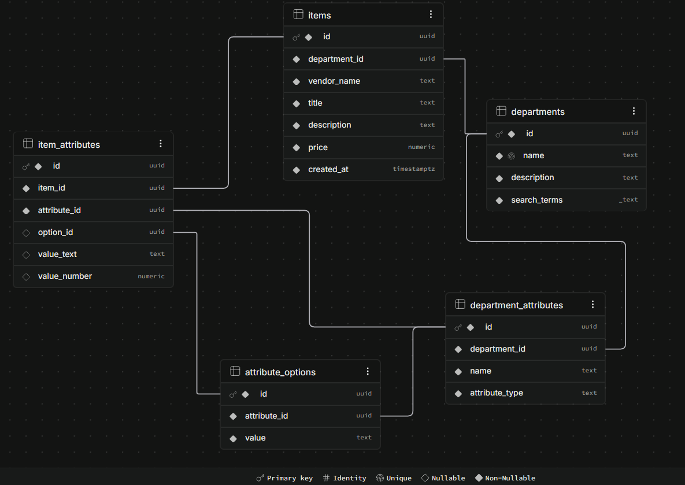

# Citi-mazon

A repo to demonstrate an implementation of Amazon's department dynamic filter system based on user search.

Mind that I am aware that there are a number of vulnerabilities and some places where best practices were not implemented for the sake of time.

With that out of the way, the goal was to design an Amazon stlye dynamic filter bar based on search. I did this by creating a basic search system that suggests filters based on the department that the searches fall under. This does require the user to first specifiy which department they would like to filter by when there is ambiguitity between multiple departments. In the case of a single departments results showing from a search, the user will be correctly presented with only that departments filters.

They way this was architected took into account 3 sides. The first being the site, which curates the departments and required attributes for filtering. The second is the vendors who list items under a department with the required attributes. Last is the user who searches for and filters based on the rest of the system.

The system use Supabase (serverless PostgreSQL) for its relational core. I designed the schema to fit the system mentioned above with the 3 types of users. I will provide a screenshot of the schema to make it easier to understand, but practically there are departments which have departe attributes (which, when using the select type, can have attribute options that are like a site defined enum), and then there are items which have item attributes.



Items are listed in departments and have a set of attributes. Every item has a price that it can be filtered by. Other attributes align with the department required attributes. This esures that filters work on all items in the department.

Searches are checked against item titles and descriptions and department names and search terms using PostgreSQL's ilike (string matching, case insensitive).

Some example searches:
- "office" shows an abiguous case that requires department clarification
- "laptop" shows a single department search

Some things that could have been done better:
1. Transactions. There are definitely race conditions in the backend.
2. Allow not required attributes. Just would have taken more time to integrate into the dynamic filter system.
3. Should go without saying, but security. This is just a demo for the search concept.

## Setup

```bash
uv sync --group dev
cp .env.example .env   # SUPABASE_URL, SUPABASE_PUBLISHABLE_KEY, SUPABASE_SERVICE_ROLE_KEY, SECRET_KEY
npm install
```

## Run

```bash
uv run python app.py
```

Portals: `/user` (search), `/vendor` (list items), `/site` (manage departments).

## Test

```bash
uv run pytest -v
```

## Supabase schema

```bash
npx supabase link --project-ref <project-ref>
npx supabase db push
```

Migrations live in `supabase/migrations/`.

## Seed data

After schema is applied, load Citi themed demo data:

```bash
uv run python scripts/seed_data.py
```

## Deploy

Render: build `pip install -r requirements.txt`, start `gunicorn app:app --bind 0.0.0.0:$PORT`. Set `SUPABASE_URL`, `SUPABASE_SERVICE_ROLE_KEY`, and `SECRET_KEY`. Auto-deploy after CI passes on `main`.
